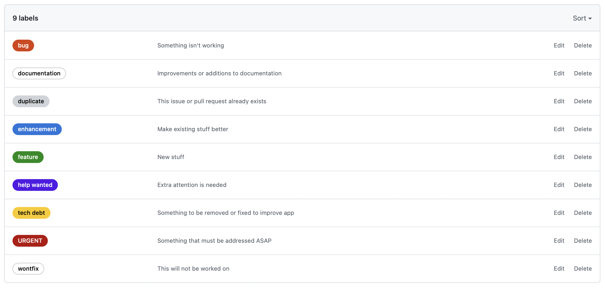

# Repository Style Guide

This guide will break down my recommended style for code repositories.  It can be helpful to include this in the repository README.

_Replace this section with information about why this style guide has been included._

## TOC

1. [Branches](#branches)
  - [Release Branches](#release-branches)
  - [Version Branches](#version-branches)
  - [Feature Branches](#feature-branches)
1. [Issues](#issues)
1. [Projects](#projects)
1. [Releases](#releases)
1. [Issue Templates](#issue-templates)
  - [Bug Report Template](#bug-report-template)
  - [Enhancement Template](#enhancement-template)
  - [Feature Template](#feature-template)

## Branches

**Release Branches**

These branches should be configured with branch protection, preventing contributors from merging directly into these branches.  Instead contributors should be required to submit a pull request which must be approved by at least one other contributor.

_Examples_:
- `release/production`
- `release/staging`
- `release/development`

**Version Branches**

Version branches do not require branch protection, but could be configured as such if the development team is large.  With branch protection, these branches would prevent merge commits to reduce the risk of code overwrites if local merges are performed incorrectly.  Ideally, the pull request approver would catch any issues and require changes before approving.

_Examples_:
- `1.0.0`
- `1.0.x`
- `1.1.0`
- `2.0.0`

**Feature Branches**

Feature branches are created by contributors to manage their own development.  These branches do not require any protection should be removed once the new feature code has been successfully merged into the version branch.

These branches should always coorespond to a specific Issue with the name representing that connection.

_Example_:

- _GitHub Issue_
  > #216 - Link color not changing on hover
- _Branch_
  > 216-hover-link-color

## Issues

Issues are useful to help manage the backlog of feature requests and bug fixes.  Issues can be added by customers, users, or the developer(s) and should be updated frequently.

To help the user who is creating the new issue, setup [Issue Templates](#issue-templates) to ensure that you get all of the needed information.  3 issue templates typically cover most use cases.

When a developer begins work on an issue, they should assign it to themselves and ensure that all data and metadata is accurate.  The two most important pieces of metadata are the **assignee** and the **label**:  

- _Assignee_: assigning yourself or another developer to an issue alerts every stakeholder that someone is managing the issue.
  - Multiple developers can be assigned to the same issue if needed.
  - Tagging (@user) can be used to involve other users.
- _Label_: before beginning development, the label should be set to the type of work that is being done.  The following labels are the most used and helpful.



Note: the comments section should be used to keep track of crucial decisions made while developing the feature.  

## Projects

Using projects to sort your issues can be helpful to keep a better hold on what matters right now.  To get started, ensure that there are always a few projects created.  The number of projects may vary depending on the stage of development.

### New Project, Example

At the beginning of a development project, typically the concerns are more focussed on getting to a shipping product.  Therefore, there are only 2 projects to setup: features to work now and features to work later.

> _Name_: **1.0.0**
> 
> _Description_: Planning features in version 1.0
> 
> _Template_: Automated kanban

> _Name_: **2.0.0**
> 
> _Description_: Planning features in version 2.0
> 
> _Template_: Automated kanban

### Existing Project, Example

With an existing development project, there is a lot more to deal with.  At any point in time, bugs could arise in the current version, or a new feature could be requested.  To deal with this wave, at least 4 projects should be running at all times.

Setting the stage: version 1.0.0 has been deployed and version 1.1.0 is in active development.

> _Name_: **1.0.x**
> 
> _Description_: Catch-all for bugs found in version 1.0
> 
> _Template_: Bug triage

> _Name_: **1.1.0**
> 
> _Description_: Planning features in version 1.1
> 
> _Template_: Automated kanban

> _Name_: **1.2.0**
> 
> _Description_: Planning features in version 1.2
> 
> _Template_: Automated kanban

> _Name_: **2.0.0**
> 
> _Description_: Planning features in version 2.0
> 
> _Template_: Automated kanban

## Releases

Releases provide a simple way to keep track of changes over time.  When a release is created, a tag is created that can be used as a reference to the commit that contains the change.  This reference is a good marker in case a rollback to a previous version is needed.

Releases should only be greated on the main branch.  For example, your main branch could be named any of the following:

- `main`
- `master`
- `release/production`

Always provide good release notes in your release.  These notes provide an easy go-to list of historical changes for both developers and users.

### New Version, Example

- _Tag_: v1.0.0
- _Title_: Release 1.0.0

```
Provide a message outlining the release as a whole.
This can be a short paragraph about the changes and the advantages provided by the changes.

# Enhancements

- List item 1
- List item 2
  - Sub-list item 1
- List item 3

# Bug Fixes

- List item 1
- List item 2
```

### Bug Fix, Example

- _Tag_: v1.0.1
- _Title_: Release 1.0.1

```
# Bug Fixes

- List item 1
- List item 2
```

## Issue Templates

### Bug Report Template

[Template](./issue-template-bug.md) - [Example](./assets/issue-bug.jpeg)

**Template Name**

> **Bug report**

**About**

> Create a report to help us improve

**Template Content**

> **Requestor**
> 
> _Who first became aware of this issue?  If you are entering this for yourself, enter your info._
> 
> **Describe the bug**
> 
> _A clear and concise description of what the bug is._
> 
> **To Reproduce**
> 
> Steps to reproduce the behavior:
> 1. Go to '...'
> 2. Click on '....'
> 3. Scroll down to '....'
> 4. See error
> 
> **Expected behavior**
> 
> _A clear and concise description of what you expected to happen._
>  
> **Screenshots**
> 
> _If applicable, add screenshots to help explain your problem._
>  
> **Device information (please complete the following information):**
> - Browser [e.g. edge, chrome, firefox]
>  
> **Additional context**
> 
> _Add any other context about the problem here._

### Enhancement Template

[Template](./issue-template-enhancement.md) - [Example](./assets/issue-enhancement.jpeg)

**Template Name**

> **Enhancement request**

**About**

> Suggest a change to the project

**Template Content**

> **Requestor**
> _Who first became aware of this issue?  If you are entering this for yourself, enter your info._
>  
> **Is your request related to a problem? Please describe.**
> _A clear and concise description of what the problem is. Ex. I'm always frustrated when [...]_
>  
> **Describe the solution you'd like**
> _A clear and concise description of what you want to happen._
>  
> **Additional context**
> _Add any other context or screenshots about the feature request here._

### Feature Template

[Template](./issue-template-feature.md) - [Example](./assets/issue-feature.jpeg)

**Template Name**

> **Feature request**

**About**

> Suggest a new idea for this project

**Template Content**

> **Requestor**
> _Who first became aware of this issue?  If you are entering this for yourself, enter your info._
>  
> **Is your feature request related to a problem? Please describe.**
> _A clear and concise description of what the problem is. Ex. I'm always frustrated when [...]_
>  
> **Describe the solution you'd like**
> _A clear and concise description of what you want to happen._
>  
> **Describe alternatives you've considered**
> _A clear and concise description of any alternative solutions or features you've considered._
>  
> **Additional context**
> _Add any other context or screenshots about the feature request here._